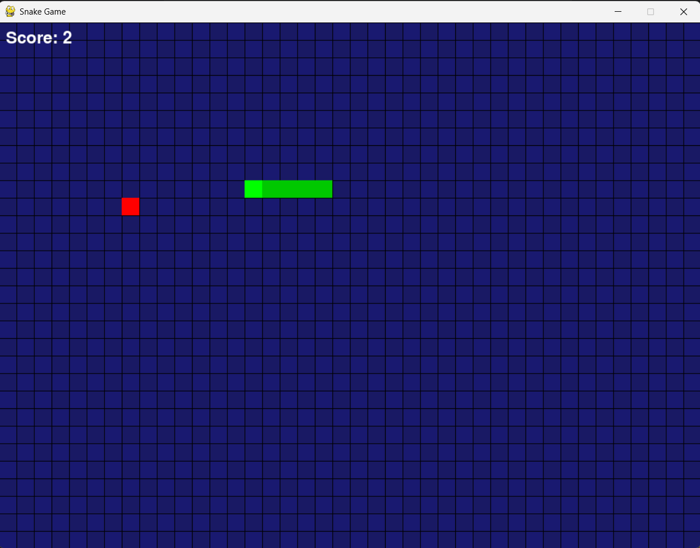

# Snake Game (Pygame)

A simple and interactive **Snake Game built using Python and Pygame**.  
The player controls the snake using arrow keys, eats food to grow, and avoids collisions with walls and itself.

---

## Features

- Smooth snake movement using keyboard controls
- Food (apple) spawning at random positions
- Snake grows when food is eaten
- Score tracking system
- Collision detection:
  - Wall collision → Game Over
  - Self collision → Game Over
- Grid-based game design

---

## Screenshot



---

## How It Works

- The game runs on a grid system
- Snake is represented as a list of `(x, y)` positions
- Each frame:
  - A new head is added based on direction
  - Tail is removed unless food is eaten
- Food is generated randomly, avoiding snake positions

---

## Controls

| Key | Action |
|-----|--------|
| ⬆️ Up Arrow | Move Up |
| ⬇️ Down Arrow | Move Down |
| ⬅️ Left Arrow | Move Left |
| ➡️ Right Arrow | Move Right |
| ❌ Close Window | Exit Game |

---


## 📦 Installation & Run

### 1. Clone the repository
```bash
git clone https://github.com/your-username/snake-game.git
cd snake-game

## Requirements

- Python 3.8+
- pygame

## Setup

1. Create/activate a virtual environment (recommended):

```bash
python -m venv .venv
.venv\Scripts\activate  # Windows
```

2. Install dependencies:

```bash
pip install -r requirements.txt
```

## Run

```bash
python snake.py
```

Have fun! 